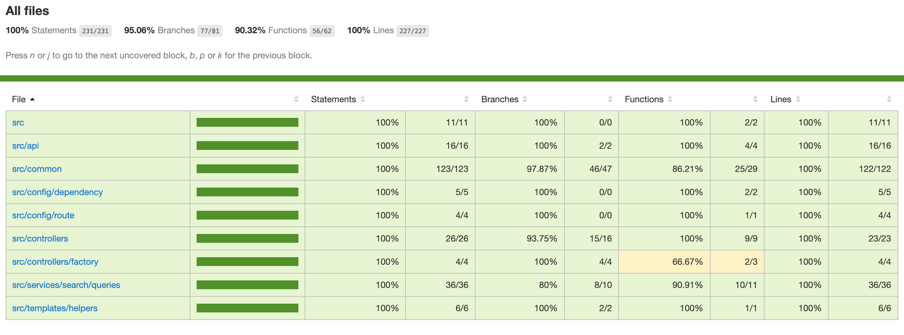

# hapi

Building Web Applications with hapi

## TODO

1. Setup hapi and dependencies
2. Build project structure with MVC pattern
   - Apply SOLID principle
   - Apply CQRS principle
   - Apply Resilience principle
   - Apply Design pattern
3. Setup cross-cutting concern
   - Circuit Breaker
   - Logger
   - Paging
   - Sanitizer
4. Setup Jest unit test
5. Setup Tooling
   - Swagger

## Node version v14.15.5

```
> nvm -v
> nvm ls
> nvm ls-remote
> nvm install <version>
> nvm use <node version>
```

## Install dependencies

```
> npm i
```

## How to run application

```
> npm start
```

## How to run test

```
> npm test
> npm run test-coverage
> npm run test-snapshot
```



## How to see document Api specification

```
http://localhost:3000/documentation
```

## How to execute

Install plugin REST Client
Go to file `request.rest` at root folder

```
GET http://localhost:3000/search?text=nodejs&perPage=10&page=1&range=10
###
POST http://localhost:3000/api/messages HTTP/1.1
Content-Type: application/json

< ./mock.json
###
```
